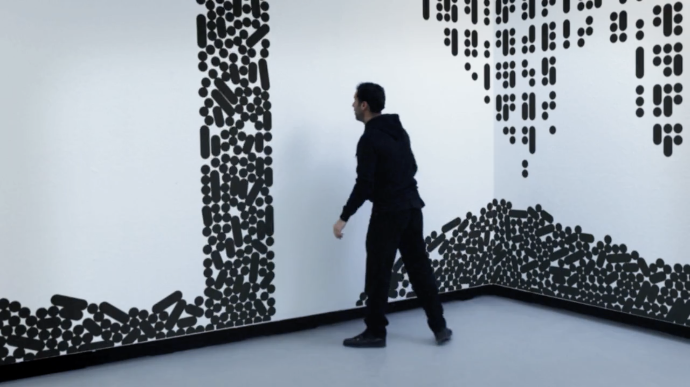
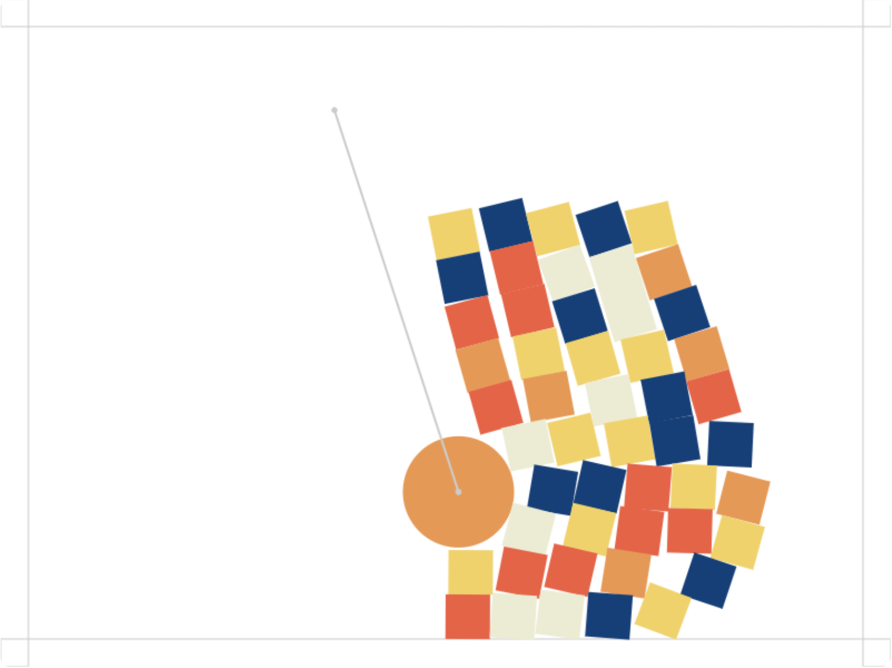
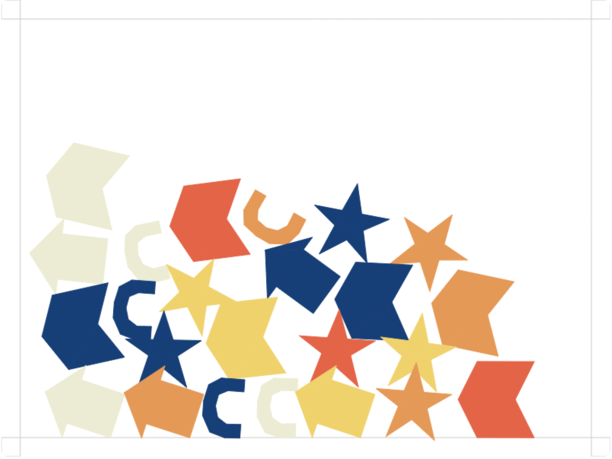

### xwan0644_9103_tut01

```
Our group has chosen Piet Mondrian's 'Broadway Boogie Woogie' as the basis. While recreating the painting with code is relatively straightforward, my research emphasizes interactive and animated reconstruction. 
```

###  *1.Imaging Technique Inspiration*
The art work that inspired me is a work created by a studio called Büro Achter April for transmediale.11.
>[Here is the video link](https://vimeo.com/19249326)


Inspired by Büro Achter April's work for transmediale.11, our work can interact dynamically in this way: Click on colored blocks within the painting, causing them to collide, fall, and stack.

 Users can create air walls by dragging the mouse, which squeeze these blocks to rearrange them, forming new lines by the user's creativity. This interaction dynamically reconstructs the painting while preserving its essential characteristics.
###  *2.Coding Technique Exploration*
Matter-js, a 2D rigid body physics engine for the web might make my idea come true.
>[Here is the demo page link.](https://brm.io/matter-js/demo/#mixed)


Existing code enables 2D graphics collisions and movements through mouse dragging, causing shapes to interact with each other.

To achieve my expected concept, the code logic for mouse clicks and drags must be modified to trigger different interactions.  The first step involves creating a transparent object on mouse click, which is removed upon release. The second step redefines the collision boundaries of shapes within the dragged area, allowing them to rearrange and stack, effectively reconstructing the image.
>[Here is the source code link.](https://github.com/liabru/matter-js?tab=readme-ov-file)
